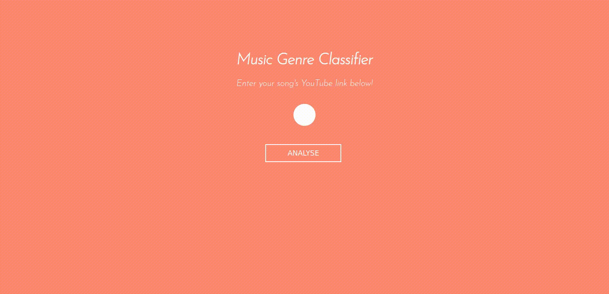

# Genre classifier


This is a tool that uses a convolutional neural network to predict the genre of a given song, provided by the user via a YouTube link. In the demo above, the link is to [Chopin's 2nd Nocturne](https://www.youtube.com/watch?v=9E6b3swbnWg).

It is based on the brilliant work of [Valerio Velardo](https://github.com/musikalkemist) and trained with the [MARSAYAS](http://marsyas.info/downloads/datasets.html) dataset which contains 10 different genres: Jazz, Rock, Disco, Pop, Country, Reggae, Hiphop, Blues, Metal and Classical.

It was built in Python with Tensorflow/Keras and Librosa. The NN architecture is 3 convolutional layers and a dense layer, outputting to a softmax layer as follows:

```buildoutcfg
_________________________________________________________________
Layer (type)                 Output Shape              Param #   
=================================================================
conv2d (Conv2D)              (None, 128, 11, 32)       320       
_________________________________________________________________
max_pooling2d (MaxPooling2D) (None, 64, 6, 32)         0         
_________________________________________________________________
batch_normalization (BatchNo (None, 64, 6, 32)         128       
_________________________________________________________________
conv2d_1 (Conv2D)            (None, 62, 4, 64)         18496     
_________________________________________________________________
max_pooling2d_1 (MaxPooling2 (None, 31, 2, 64)         0         
_________________________________________________________________
batch_normalization_1 (Batch (None, 31, 2, 64)         256       
_________________________________________________________________
conv2d_2 (Conv2D)            (None, 30, 1, 64)         16448     
_________________________________________________________________
max_pooling2d_2 (MaxPooling2 (None, 15, 1, 64)         0         
_________________________________________________________________
batch_normalization_2 (Batch (None, 15, 1, 64)         256       
_________________________________________________________________
flatten (Flatten)            (None, 960)               0         
_________________________________________________________________
dense (Dense)                (None, 64)                61504     
_________________________________________________________________
dropout (Dropout)            (None, 64)                0         
_________________________________________________________________
dense_1 (Dense)              (None, 10)                650       
=================================================================
Total params: 98,058
Trainable params: 97,738
Non-trainable params: 320
_________________________________________________________________

```

If you feed it a generic piece of music from a mainstream western artist, it identifies the genre pretty well. However, the model doesn't generalise exceptionally well, for example classifying most Italian pop as Country. On the test set, the model achieves an accuracy in the order of 77%.

However, it was a tonne of fun to make and I learned a lot, which was the main objective.

The project was built using Test Driven Development, and includes a suite of tests. The REST API was developed using Flask.

## Installation

Install the requirements.

```bash
pip install -r requirements.txt
```

## Usage
Run the server:
```python
python app.py
```
Navigate to localhost:5000 on your browser.

Enter a valid YouTube link to a musical track <15 minutes long.

## Contributing
Pull requests are welcome. For major changes, please open an issue first to discuss what you would like to change.

Please make sure to update tests as appropriate.

## License
Shield: [![CC BY 4.0][cc-by-shield]][cc-by]

This work is licensed under a
[Creative Commons Attribution 4.0 International License][cc-by].

[![CC BY 4.0][cc-by-image]][cc-by]

[cc-by]: http://creativecommons.org/licenses/by/4.0/
[cc-by-image]: https://i.creativecommons.org/l/by/4.0/88x31.png
[cc-by-shield]: https://img.shields.io/badge/License-CC%20BY%204.0-lightgrey.svg
